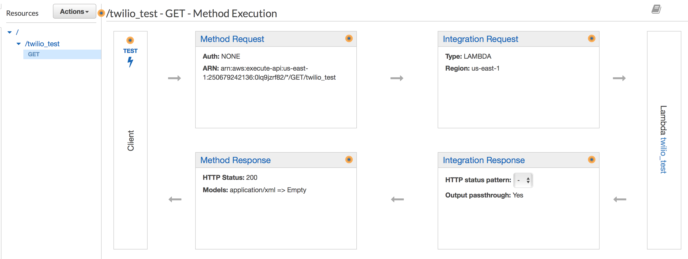

Python + AWS Lambda + Twilio
===

Using Python, Twilio and AWS Lambda to create a texting app.

##### By: Darye Henry - CTO @ DeveloperTown Starts

---
Guidelines
===
- Create a proof of concept trivia texting app in 30 mins or less
- No servers
- Don't know a lot about Python - hopefully will want to learn more :)

---
Technologies used:
===

- AWS Lambda
- AWS API Gateway
- Python 2.7
- Twilio

---
Getting Started
===
- Does not take a lot of code 
- More Lambda and API Gateway configuration than code for a very simple app

---
Minimal code required
===
```
def lambda_handler(event, context):
    
    return "Thanks for texting"
```
---
Create Lambda Function in AWS
===

# 

---
Create your custom role
===
# 

---
Add an API Gateway
===
# 

---
Add Code
===
```
def lambda_handler(event, context):

    message = unicode(str(event['Body']), 'utf-8')
    phone_number = event['From']

    if message.lower() == u"start":
        return "In California, it is illegal to eat oranges while doing what?\n1) Gardening\n2) Bathing\n3) Driving\n4) Working on a computer";
    elif message == "2" or message.lower() == "bathing":
        return "Lucky guess"
    elif message == "1" or message.lower() == "gardening":
        return "Wrong, you lose"
    elif message == "3" or message.lower() == "driving":
        return "Nope"
    elif message == "4" or message.lower() == "working on a computer":
        return "It is literally impossible for you to be more wrong"
```

---
Add Code
===
1. In your local environment create a new project folder
2. Add a file called `lambda_function.py`
3. Download the Python Twilio Library
4. Zip `lambda_function.py` and the `twilio` folder 
5. Upload .zip file to lambda

---
Add Code
===
# 

---
Configure your test event
===
# 

---
Configure your test event
===
# 

---
Configure your API
===

---
Create a new "GET" method
===
# 

---
Create a new "GET" method
===
Enter your lamda
# 

---
Get Method Details
===
# 

---
Integration Request
===
Insert template to transform GET params to JSON
# 

---
Method Response
===
Change to `application/xml`
# 

---
Integration Response
===
Change to `application/xml`, enter in Twilio XML Format as template
# 

---
Almost forgot - Deploy your API !!
===
Save yourself wasted debugging time
# 

---
Setup Twilio
===
1. Create New Phone Number
2. Go to Manage Numbers > Active Numbers
3. Select your Phone Number
4. Edit Messaging WebHook - Insert your API Url

# 

---
End Results
===
# 
---

You are ready to test!
===
Text **"Start"** to **317-827-7668** (or your Twilio number)


---
Inspiration: Call Me In 5
===

- Quit asking friends to interrupt dates and meetings. 
- Feel important
- Get interrupted by just telling `Call Me In 5` to call you in 5 mins (or whatever)

---
Try it out!
===
Text **"Hey"** to **317-854-0143**

---
Connect
===
- GitHub: github.com/darye
- email: dhenry@developertown.com
- twitter: @darye


